  
  
  

## Featured work

<table>
<tr>
<td width="40%">
  
  
<b><a href="https://github.com/dikshant-agrawal/Doom_STM32N6">Neural network playing Doom on the STM32N6 NPU</a></b> PyTorch → int8 → real-time on-device inference

</td>
<td>

- 🛞 [**egas-pedal-control**](https://github.com/dikshant-agrawal/egas-pedal-control) — E-Gas electronic throttle: joystick→ADC→RTE→PWM, AUTOSAR-style SWCs on Erika RTOS
- 📡 [**xbee-zigbee-driver**](https://github.com/dikshant-agrawal/xbee-zigbee-driver) — Zigbee CDD for a fleet of experimental student cars *(architecture public, source on request)*
- 🔬 [**bandpass-amplifier-pcb**](https://github.com/dikshant-agrawal/bandpass-amplifier-pcb) — hand-calculated 4-layer KiCad PCB, DRC-clean, breadboard-verified
- ⏱️ [**timing-analyzer-api**](https://github.com/dikshant-agrawal/timing-analyzer-api) — cycle-accurate firmware profiling via DWT/SysTick, OO-style C
- 🎛️ [**nios2-max10-experiments**](https://github.com/dikshant-agrawal/nios2-max10-experiments) — custom Avalon peripherals in SystemVerilog + Nios II soft-core
- ⏰ [**electronic-clock-rte**](https://github.com/dikshant-agrawal/electronic-clock-rte) — ECU-style RTE architecture, live demo GIF inside

**→ [All projects, with case studies, on my portfolio](https://dikshant-agrawal.github.io/projects.html)**

</td>
</tr>
</table>

## Telemetry

  
  

  

  

  
  
  
  
  
  
  
  
  
  

  
  
  

